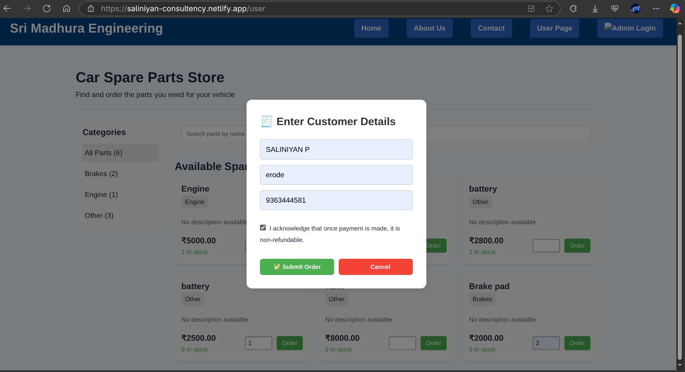
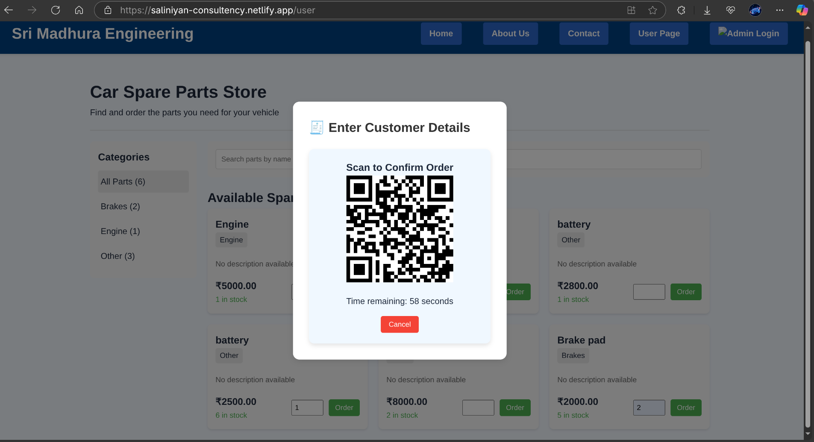
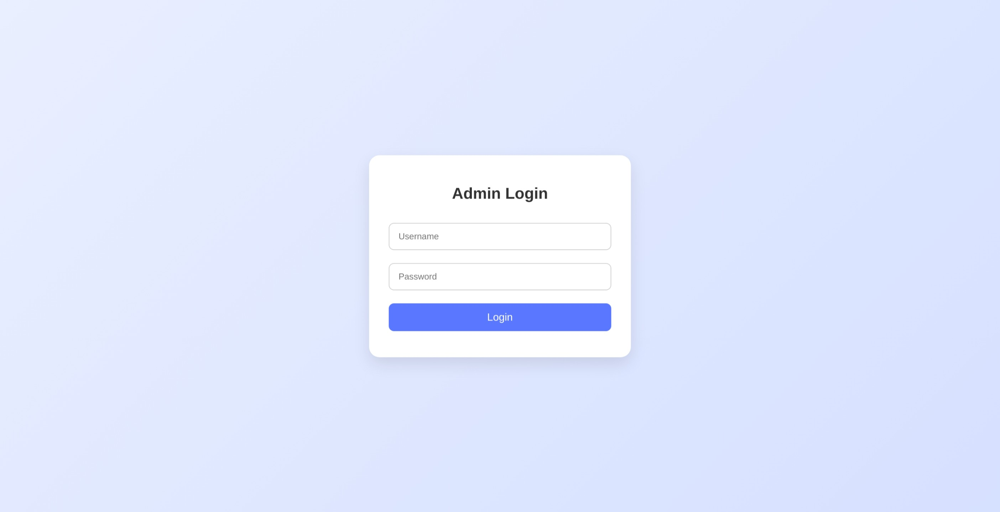
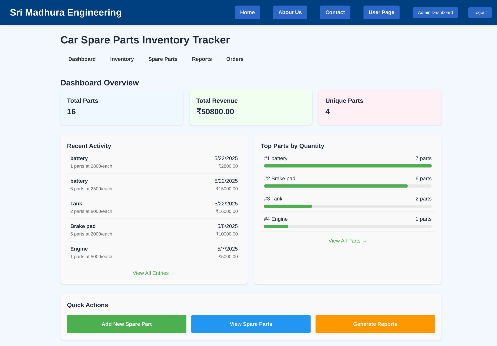
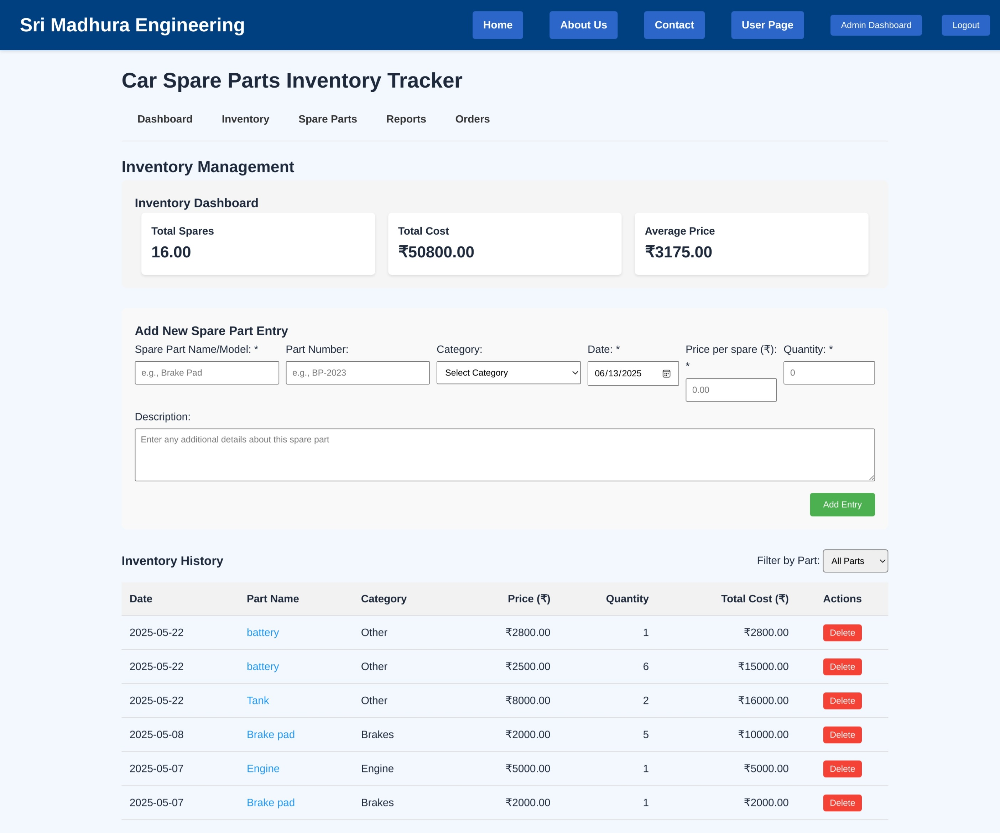
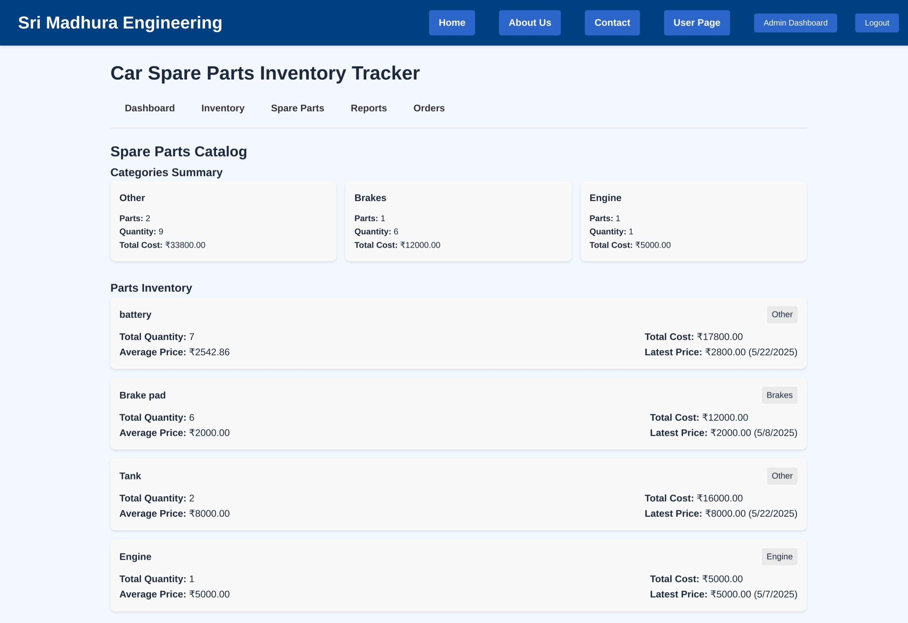
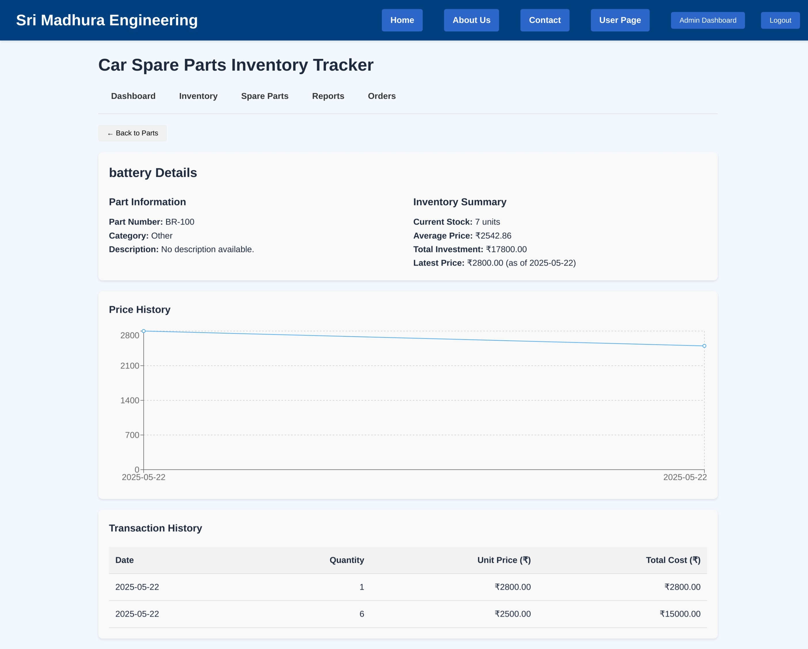
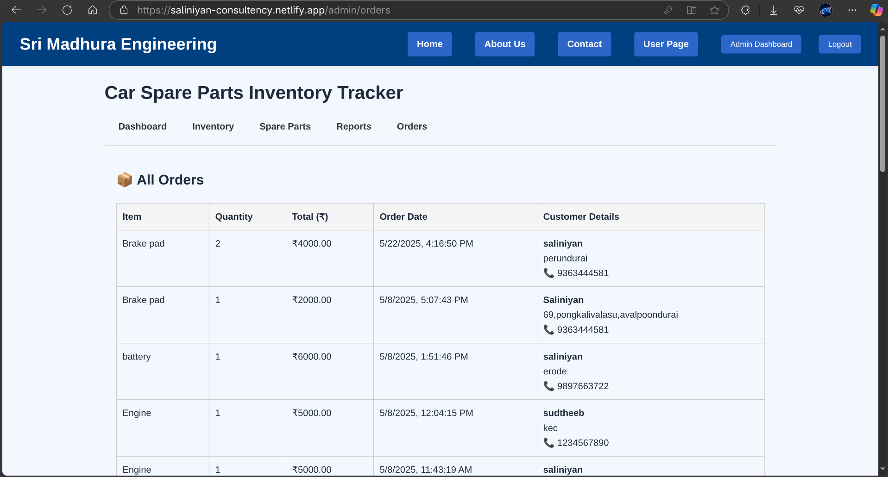

# 🚗 Stock Tracker - Car Spare Parts Inventory & Order Management

This project is a **Stock Tracker Web Application** designed to manage car spare parts inventory and order processing efficiently. It is a full-stack application built with a React frontend, Express.js backend, and MongoDB database.

**🔗 Hosted Link**: [https://saliniyan-consultency.netlify.app](https://saliniyan-consultency.netlify.app)

---

## 📌 Features

### 👨‍💼 Admin Features

- 🔧 **Add Spare Parts**: Admin can add new car spare parts to the inventory.
- 📋 **View & Manage Inventory**: View current stock and update quantities.
- 📑 **View All Orders**: Track every order placed by users.
- 📊 **Inventory Insights**: Analyze stock availability and demand trends.

### 🙋‍♂️ User Features

- 🛒 **Place Orders**: Users can browse available spare parts and place orders.
- 📊 **Dashboard**: Users can view spare part trends.

---

## 🧰 Tech Stack

| Frontend   | Backend    | Database | Others                                 |
|------------|------------|----------|----------------------------------------|
| React.js   | Express.js | MongoDB  | Local Storage (for session management) |

---

## 🚀 Getting Started

### 🛠️ Installation

1. **Clone the repository**

```bash
git clone https://github.com/your-username/stock-tracker.git
cd stock-tracker

    Install Backend Dependencies

cd server
npm install

    Install Frontend Dependencies

cd ../client
npm install

    Set up Environment Variables

In the server directory, create a .env file with the following:

MONGO_URI=your_mongodb_connection_string
PORT=5000

    Run the Application

    Start the backend server:

cd server
node server.js

    Start the frontend React app:

cd ../client
npm start

Now open your browser and go to: http://localhost:3000
```

🔐 Authentication

    Admin Username: admin

    Admin Password: 123

## 📸 Screenshots

### 🏠 Home Page


### 👤 User Page


### 📝 Fill Detail Page


### 🔳 QR Code Page


### 🔐 Login Page


### 🛠️ Admin Dashboard


### ➕ Add Product Page


### 📦 Stock Management Page


### 💰 Stock Price Analysis


### 📃 Order List Page

